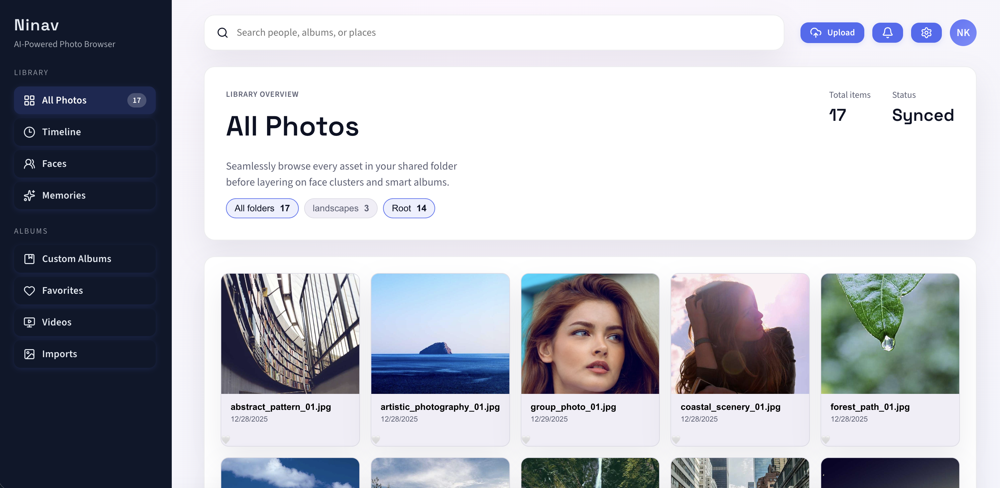
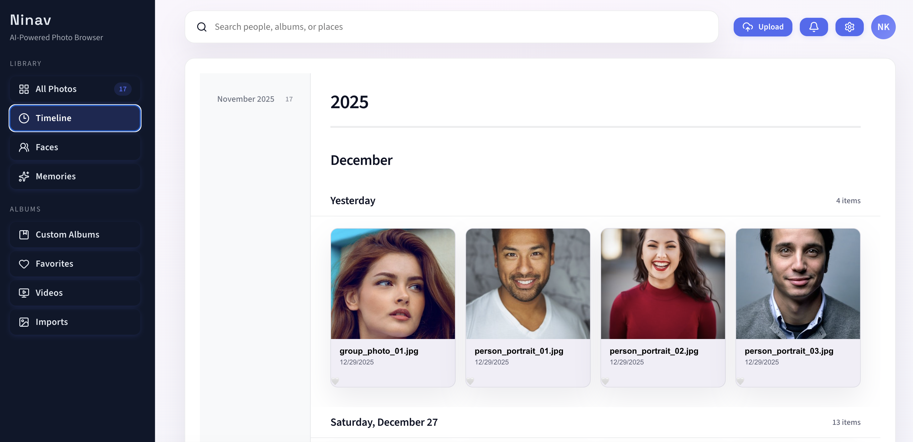
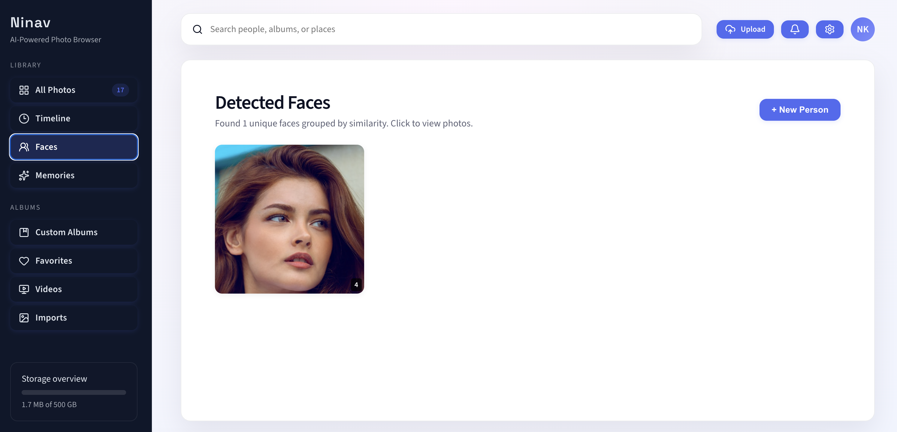

<div align="center">

# 📸 Ninav

**A privacy-first, self-hosted photo management system with intelligent face recognition**

[](LICENSE)
[](https://www.python.org/)
[](https://react.dev/)
[](https://fastapi.tiangolo.com/)
[](https://www.typescriptlang.org/)

[Features](#-features) • [Demo](#-demo) • [Quick Start](#-quick-start) • [Documentation](#-documentation) • [Contributing](#-contributing)

</div>

---

## 🌟 Overview

Ninav is a modern, self-hosted photo management application that provides automatic face detection, intelligent clustering, and intuitive organization—all while keeping your photos private and under your control.

Unlike cloud-based solutions, your photos never leave your infrastructure. The application operates as a **non-destructive overlay**—it indexes and analyzes your existing photo collection without modifying the original file structure.

### Why Ninav?

- **🔒 Privacy-First**: Self-hosted, no cloud dependencies, your data stays yours
- **🚀 Modern Stack**: Built with FastAPI, React 19, and TypeScript
- **🎯 Smart Organization**: Automatic face detection and clustering using ML
- **📱 Responsive Design**: Beautiful, intuitive UI
- **🔄 Non-Destructive**: Works as an overlay—never modifies your original photos
- **🐳 Easy Deployment**: Docker Compose setup ready to go

---

## ✨ Features

### Current Release (v1.0)

#### 📷 Photo Management
- **Smart Gallery**: Browse photos with responsive grid layout and timeline view
- **Folder Navigation**: Organize by directory structure without moving files
- **Fast Search**: Quick filtering by folders and favorites
- **Image Operations**: Rename, delete, and favorite photos
- **Lightbox Viewer**: Full-screen image viewing with zoom and pan controls

#### 🤖 Face Recognition
- **Automatic Detection**: Powered by `face_recognition` library (dlib-based)
- **GPU Acceleration**: Optional remote GPU worker for 30-100x faster processing (see [gpu_worker/](gpu_worker/))
- **Face Clustering**: Group similar faces using cosine similarity
- **Person Management**: Create, rename, and organize people
- **Face Assignment**: Manual review and assignment of detected faces
- **Smart Suggestions**: Intelligent face grouping based on embeddings

#### 🎨 User Experience
- **Timeline View**: Chronological organization of your photo library
- **Favorites System**: Mark and filter favorite photos
- **Keyboard Navigation**: Efficient browsing with arrow keys
- **Loading States**: Smooth skeleton screens and progressive loading
- **Error Handling**: Graceful fallbacks for missing images

### 🚧 Roadmap

<details>
<summary>Planned Features (click to expand)</summary>

#### Short-term (v1.1-1.2)
- [ ] Thumbnail generation for faster grid loading
- [ ] Advanced search (by date, location, people)
- [ ] Bulk operations (multi-select, batch assignment)
- [ ] Export and sharing capabilities
- [ ] Progressive Web App (PWA) support

#### Medium-term (v2.0)
- [ ] Multi-user support with authentication
- [ ] Album creation and management
- [ ] Automatic memory generation
- [ ] Video support and thumbnails
- [ ] Mobile app (React Native)
- [ ] Advanced ML models (InsightFace, MediaPipe)

#### Long-term (v3.0+)
- [ ] Object detection and tagging
- [ ] Scene recognition
- [ ] Duplicate detection
- [ ] Cloud backup integration (optional)
- [ ] AI-powered search (natural language)

</details>

---

## 🎬 Demo

<div align="center">

### Gallery View

*Browse your photo collection with a responsive grid layout*

### Timeline Organization

*Organize photos chronologically with the timeline view*

### Face Recognition

*Automatic face detection and intelligent clustering*

</div>

---

## 🚀 Quick Start

### Prerequisites

- **Docker & Docker Compose** (recommended) OR
- **Python 3.12+** and **Node.js 18+** for local development
- **4GB+ RAM** (for face detection processing)
- **Linux/macOS** (Windows via WSL2)

### Option 1: Docker Compose (Recommended)

1. **Clone the repository**
   ```bash
   git clone https://github.com/rnagarajanmca/ninav.git
   cd ninav
   ```

2. **Configure your photo directory**
   ```bash
   # Edit the volume mount in docker-compose.yml
   # Change ./sample_images to your photos directory
   # - /path/to/your/photos:/data/images:ro
   ```

3. **Start the application**
   ```bash
   docker compose up --build
   ```

4. **Access the application**
   - Frontend: http://localhost:5180
   - Backend API: http://localhost:8080/api
   - API Docs: http://localhost:8080/docs

### Option 2: Local Development

<details>
<summary>Manual setup without Docker (click to expand)</summary>

#### Backend Setup

```bash
# Navigate to backend directory
cd backend

# Create virtual environment
python3.12 -m venv ../.venv
source ../.venv/bin/activate  # On Windows: ..\.venv\Scripts\activate

# Install dependencies
pip install -r requirements.txt

# Set environment variables
export IMAGE_ROOT=/path/to/your/photos
export CORS_ORIGINS=http://localhost:5173

# Initialize database
python -m app.db.init_db

# Start backend server
uvicorn app.main:app --reload --host 0.0.0.0 --port 8000
```

#### Frontend Setup

```bash
# Navigate to frontend directory (in a new terminal)
cd frontend

# Install dependencies
npm install

# Start development server
npm run dev
```

Access the application at http://localhost:5173

</details>

---

## 📖 Documentation

### Architecture

```
ninav/
├── backend/                 # FastAPI application
│   ├── app/
│   │   ├── api/            # REST API endpoints
│   │   ├── core/           # Configuration & settings
│   │   ├── db/             # Database session & initialization
│   │   ├── models/         # SQLModel database models
│   │   ├── repositories/   # Data access layer
│   │   ├── schemas/        # Pydantic request/response schemas
│   │   ├── services/       # Business logic (face detection, clustering)
│   │   └── utils/          # Helpers and utilities
│   ├── Dockerfile
│   └── requirements.txt
│
├── frontend/                # React application
│   ├── src/
│   │   ├── components/     # React components
│   │   ├── hooks/          # Custom React hooks
│   │   ├── lib/            # API client & utilities
│   │   └── types/          # TypeScript type definitions
│   ├── package.json
│   └── vite.config.ts
│
├── data/                    # SQLite database (auto-created)
├── sample_images/           # Sample photos (mount your directory here)
├── docs/                    # Additional documentation
├── docker-compose.yml       # Docker orchestration
└── README.md
```

### API Documentation

Once running, visit http://localhost:8080/docs for interactive API documentation (Swagger UI).

#### Core Endpoints

| Endpoint | Method | Description |
|----------|--------|-------------|
| `/api/health` | GET | Health check |
| `/api/images` | GET | List images (paginated) |
| `/api/images/rename` | POST | Rename an image |
| `/api/images/delete` | POST | Delete an image |
| `/api/faces` | GET | List detected faces |
| `/api/faces/clusters` | GET | Cluster similar faces |
| `/api/persons` | GET | List recognized people |
| `/api/persons` | POST | Create a person |
| `/api/persons/{id}/assign` | POST | Assign faces to person |
| `/media/{path}` | GET | Serve image files |

### Configuration

Configure the application via environment variables:

#### Backend Configuration

| Variable | Default | Description |
|----------|---------|-------------|
| `IMAGE_ROOT` | `./sample_images` | Path to your photo directory |
| `DATABASE_URL` | `sqlite:///data/faces.db` | Database connection string |
| `CORS_ORIGINS` | `["*"]` | Allowed CORS origins (comma-separated) |
| `FACE_SIMILARITY_THRESHOLD` | `0.6` | Face matching threshold (0-1) |
| `FACE_SCAN_BATCH_SIZE` | `8` | Batch size for face detection |
| `GPU_WORKER_URL` | `None` | Optional GPU worker URL for acceleration |

#### Frontend Configuration

| Variable | Default | Description |
|----------|---------|-------------|
| `VITE_API_BASE` | `http://localhost:8000/api` | Backend API URL |

### Face Detection Pipeline

The face detection system operates in several stages:

1. **Image Indexing**: Scans `IMAGE_ROOT` for supported image formats
2. **Face Detection**: Uses dlib's HOG-based detector to locate faces (or GPU worker if configured)
3. **Embedding Generation**: Creates 128-dimensional face embeddings (512-dim with InsightFace GPU)
4. **Clustering**: Groups similar faces using cosine similarity
5. **Manual Review**: Users confirm and assign faces to people

### GPU Acceleration (Optional)

For 30-100x faster face detection, you can set up a remote GPU worker:

1. See [gpu_worker/README.md](gpu_worker/README.md) for setup instructions
2. Configure `GPU_WORKER_URL` environment variable
3. System automatically uses GPU when available, falls back to CPU

**Performance Comparison:**

| Method | Speed | 1000 Images |
|--------|-------|-------------|
| CPU (dlib) | 1-2 images/sec | ~8-16 hours |
| GPU (InsightFace) | 50-100 images/sec | ~10-20 seconds |

---

## 🛠️ Development

### Tech Stack

#### Backend
- **[FastAPI](https://fastapi.tiangolo.com/)** - Modern, fast web framework
- **[SQLModel](https://sqlmodel.tiangolo.com/)** - SQL databases with Python type hints
- **[face_recognition](https://github.com/ageitgey/face_recognition)** - Face detection & recognition
- **[Pydantic](https://pydantic.dev/)** - Data validation with types
- **[Uvicorn](https://www.uvicorn.org/)** - ASGI server

#### Frontend
- **[React 19](https://react.dev/)** - UI library
- **[TypeScript](https://www.typescriptlang.org/)** - Type-safe JavaScript
- **[Vite](https://vitejs.dev/)** - Fast build tool
- **[Lucide React](https://lucide.dev/)** - Icon library

#### Infrastructure
- **[Docker](https://www.docker.com/)** - Containerization
- **[SQLite](https://www.sqlite.org/)** - Embedded database
- **[Nginx](https://nginx.org/)** - Production web server (optional)

### Running Tests

```bash
# Backend tests
cd backend
pytest

# Frontend tests
cd frontend
npm test

# Linting
npm run lint
```

### Code Quality

We maintain high code quality standards:

- **Type Safety**: Full TypeScript coverage, Python type hints
- **Linting**: ESLint for frontend, Ruff for backend
- **Formatting**: Prettier for frontend, Black for backend
- **Testing**: Pytest for backend, Vitest for frontend

### Building for Production

```bash
# Build frontend
cd frontend
npm run build

# Build Docker images
docker compose -f docker-compose.prod.yml build

# Deploy
docker compose -f docker-compose.prod.yml up -d
```

---

## 🤝 Contributing

We welcome contributions! Here's how you can help:

### Ways to Contribute

- 🐛 **Report bugs** via [GitHub Issues](https://github.com/rnagarajanmca/ninav/issues)
- 💡 **Suggest features** in [Discussions](https://github.com/rnagarajanmca/ninav/discussions)
- 📝 **Improve documentation**
- 🔧 **Submit pull requests**

### Development Workflow

1. **Fork the repository**
2. **Create a feature branch**: `git checkout -b feature/amazing-feature`
3. **Make your changes** with clear commit messages
4. **Add tests** for new functionality
5. **Run linters**: `npm run lint` and `pytest`
6. **Submit a pull request**

### Commit Convention

We follow [Conventional Commits](https://www.conventionalcommits.org/):

```
feat: add thumbnail generation
fix: resolve clustering performance issue
docs: update API documentation
refactor: simplify face detection service
test: add unit tests for repositories
```

### Code of Conduct

Please read our [Code of Conduct](CODE_OF_CONDUCT.md) before contributing.

---

## 📄 License

This project is licensed under the **MIT License** - see the [LICENSE](LICENSE) file for details.

### Third-Party Licenses

- [face_recognition](https://github.com/ageitgey/face_recognition) - MIT License
- [dlib](http://dlib.net/) - Boost Software License
- [React](https://github.com/facebook/react) - MIT License
- [FastAPI](https://github.com/tiangolo/fastapi) - MIT License

---

## 🙏 Acknowledgments

- **[Adam Geitgey](https://github.com/ageitgey)** - face_recognition library
- **[Davis King](http://dlib.net/)** - dlib machine learning toolkit
- **FastAPI & React communities** - Amazing documentation and tools

---

## 📊 Project Status

- **Current Version**: 1.0.0
- **Status**: Active Development
- **Last Updated**: December 2025

### Performance Metrics

- **Face Detection**: ~2-5 seconds per image (HOG model)
- **Database**: Handles 50k+ images efficiently
- **Memory Usage**: ~500MB backend, ~200MB frontend
- **Browser Support**: Chrome 90+, Firefox 88+, Safari 14+

---

## 🔗 Links

- **Documentation**: [Full Documentation](docs/)
- **API Reference**: [API Docs](http://localhost:8080/docs)
- **Issue Tracker**: [GitHub Issues](https://github.com/rnagarajanmca/ninav/issues)
- **Discussions**: [GitHub Discussions](https://github.com/rnagarajanmca/ninav/discussions)
- **Changelog**: [CHANGELOG.md](CHANGELOG.md)

---

## 💬 Support

Need help? Here's how to get support:

- 📖 Check the [Documentation](docs/)
- 💬 Join [Discussions](https://github.com/rnagarajanmca/ninav/discussions)
- 🐛 Report bugs via [Issues](https://github.com/rnagarajanmca/ninav/issues)

---

## ⭐ Star History

If you find this project useful, please consider giving it a star! It helps others discover the project.

[](https://star-history.com/#rnagarajanmca/ninav&Date)

---

<div align="center">

**Open Source • Privacy-First • Self-Hosted**

[⬆ Back to Top](#-ninav)

</div>
